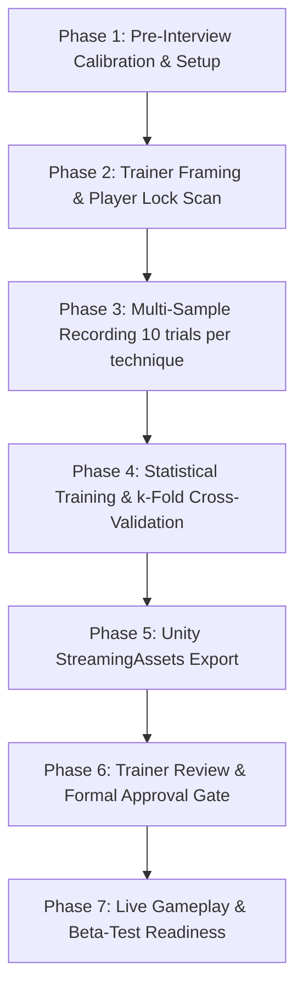

# MOTIONGUARD: Certified Trainer Interview & Dataset Recording Protocol

**Project Title:** MotionGuard: A Real-Time Motion Tracking Self-Defense Fitness Game  
**Institution:** College of Computing Studies, University of St. La Salle, Bacolod City  
**Degree:** Bachelor of Science in Computer Science (CSP220 Thesis 2)  
**Authors:** Abellana, Kendra Lynne R. | Garcio, Trixia Marie A. | Gayona, John Andrei T. | Lumauag, Roel Jr. S. | Montaño, Leyan Marie G.  
**Audited Repository:** `kendshhh/MotionGuard_Thesis2`  
**Thesis Reference:** `MotionGuard (10).pdf` (Chapter 3: Methodology & IPOO Architecture)  
**Document Purpose:** Standard Operating Procedure (SOP) for conducting the certified martial arts trainer interview, recording official expert reference datasets, validating biomechanical form, training the model, and deploying approved baseline sequences to Unity.

---

## 1. Overview & Research Context

As established in the thesis manuscript (Statement of the Problem 2, Page 2), MotionGuard evaluates user movements by comparing real-time skeletal streams against **trainer-approved expert reference datasets**. 

While the system is temporarily calibrated with tentative baseline data for interface testing, formal thesis data gathering requires recording sequences directly from a **certified martial arts instructor**. This document outlines the end-to-end protocol to record, validate, train, and deploy those official references.



---

## 2. Phase 1: Pre-Interview Environment & Hardware Setup

### 2.1 Hardware Requirements
- **Camera:** Standard external USB RGB webcam (or built-in laptop camera), minimum 720p @ 30 FPS.
- **Lighting:** Even frontal ambient lighting (diffuse indoor lighting; avoid strong backlight or direct sunlight behind the trainer).
- **Physical Space:** A minimum clear rectangular floor area of **3.0 m × 2.0 m**.
- **Camera Placement:** Position camera at approximately chest/sternum height (0.9 m – 1.2 m from floor) on a stable surface or tripod.
- **Trainer Distance:** 2.0 to 2.5 meters from the camera lens to ensure the head, shoulders, elbows, wrists, hips, knees, and feet are fully framed.

### 2.2 Software Environment Activation
Open PowerShell in the project directory and verify the environment:
```powershell
# Navigate to project root
cd "c:\Users\Kendra\OneDrive\Documents\4th Year Files\CSP220 THESIS 2\MediaPipe"

# Verify virtual environment
.\mediapipe_env\Scripts\python.exe --version
```

---

## 3. The 3 Fundamental Beginner Techniques: Biomechanical Standards

The certified trainer must perform three baseline Beginner techniques according to the standardized rubric:

### Technique 1: Controlled Straight Punch (`punch`)
- **Stance:** Solid athletic stance, non-dominant foot slightly forward. Both hands in high guard protecting chin/jaw.
- **Execution:** 
  1. Lead/dominant fist extends straight along center line toward target height (shoulder/chin level).
  2. Full arm extension without locking the elbow joint (elbow angle extends smoothly to ~170° / normalized 0.95).
  3. Non-punching hand remains firmly in defensive guard position near cheek/jaw.
  4. Torso rotates slightly with stable base; feet remain grounded.
  5. Fist recoils cleanly back into guard position.

### Technique 2: Two-Arm High Block (`block`)
- **Stance:** Neutral or athletic defensive stance, hips square to camera.
- **Execution:**
  1. Both forearms raise simultaneously in front of forehead/face.
  2. Forearms form a protective wedge/roof with elbows flexed at approximately 90° (normalized 0.50).
  3. Shoulders abduct and flex to raise the guard above eye level (normalized 0.65–0.72).
  4. Wrists maintain rigid alignment; head remains protected behind the forearm frame.
  5. Hips sink slightly into a grounded defensive posture.

### Technique 3: Protective Step-Back Exit (`escape`)
- **Stance:** Guard stance facing attacker.
- **Execution:**
  1. Guard hands stay elevated protecting head and chest.
  2. Rear foot steps smoothly backward followed by front foot, maintaining balance.
  3. Hips and knees flex into an athletic, low center-of-gravity stance (knee angles flex to ~130° / normalized 0.72).
  4. Torso remains erect with slight forward engagement (no backward stumble).
  5. Concludes in an alert, balanced ready position.

---

## 4. Phase 2: Trainer Calibration & Scale-Invariant Player Scan

To prevent spectators, students, or interviewers passing behind the camera from contaminating the recording, the system utilizes the **Scale-Invariant Player Lock Wrapper**.

### Protocol:
1. Have the trainer step into the camera view at the designated distance (2.2 m).
2. The scanner runs an initial 5-second calibration window.
3. The trainer stands upright with full body visible.
4. The system calculates the trainer's **torso anchor** and **shoulder width ruler** ($Scale$).
5. Once `PLAYER LOCKED` appears in green on the preview window, the recording window opens.
6. Anyone walking behind or to the side of the trainer will be automatically rejected and filtered out.

---

## 5. Phase 3: Step-by-Step Recording Instructions

### Workflow Option A: Multi-Sample Batch Recording (Recommended for Model Training)
This tool records 10 validated trials per technique, verifies frame counts and variance, and logs to `reference_data/reference_data.json`:

```powershell
.\mediapipe_env\Scripts\python.exe record_reference.py
```

#### What Happens in the Console:
1. **Player Lock Scan:** Prompts the trainer to stand in frame for 5 seconds until locked.
2. **Technique Prompt:** Displays: `Recording Punch - Sample 1/10`.
3. **Countdown:** 3... 2... 1...
4. **Action:** Trainer performs the technique and holds final position steadily for 3 seconds.
5. **Validation Check:** Verifies at least 18 clean frames and checks angular variance.
   - If acceptable: `✅ Quality check passed! 💾 Saved sample 1/10`.
   - If flawed/occluded: `❌ Quality check failed. Retrying...`.
6. Repeats automatically until 10 clean samples are recorded for `Punch`, `Block`, and `Escape`.

---

### Workflow Option B: Direct Unity Reference Sequence Recording
To capture high-resolution individual temporal JSON files directly for Unity:

```powershell
# 1. Record Controlled Straight Punch
.\mediapipe_env\Scripts\python.exe record_unity_reference.py punch MotionGuardUnity/Assets/StreamingAssets/MotionGuard/references/punch.json --seconds 3.0 --scan-seconds 5.0

# 2. Record Two-Arm High Block
.\mediapipe_env\Scripts\python.exe record_unity_reference.py block MotionGuardUnity/Assets/StreamingAssets/MotionGuard/references/block.json --seconds 3.0 --scan-seconds 5.0

# 3. Record Protective Step-Back Exit
.\mediapipe_env\Scripts\python.exe record_unity_reference.py escape MotionGuardUnity/Assets/StreamingAssets/MotionGuard/references/escape.json --seconds 3.0 --scan-seconds 5.0
```

*Note: Each recording starts with the 5-second Player Scan preview before the countdown initiates.*

---

## 6. Phase 4: Model Training & Statistical Validation

Once the 30 recordings (10 per technique) are captured, train the mathematical model and run $k$-fold cross-validation:

```powershell
.\mediapipe_env\Scripts\python.exe train_model.py
```

### What this Generates for Your Thesis:
1. **Model Weights:** Updates [`trained_model/reference_model.json`](file:///c:/Users/Kendra/OneDrive/Documents/4th%20Year%20Files/CSP220%20THESIS%202/MediaPipe/trained_model/reference_model.json).
2. **Empirical Thesis Tables (Chapter 4):**
   - [`output/training_accuracy_results.csv`](file:///c:/Users/Kendra/OneDrive/Documents/4th%20Year%20Files/CSP220%20THESIS%202/MediaPipe/output/training_accuracy_results.csv): Mean accuracy, standard deviation, and quality score per technique.
   - [`output/training_accuracy_folds.csv`](file:///c:/Users/Kendra/OneDrive/Documents/4th%20Year%20Files/CSP220%20THESIS%202/MediaPipe/output/training_accuracy_folds.csv): Fold-by-fold accuracy metrics for $k$-fold cross validation.

---

## 7. Phase 5: Exporting References to Unity

If using the batch recordings from `record_reference.py`, extract the highest-quality candidate sequences into Unity:

```powershell
.\mediapipe_env\Scripts\python.exe prepare_unity_references.py
```
This automatically selects the sequence with the highest quality score and exports it as an 11-feature, `featureVersion: 2` sequence to `MotionGuardUnity/Assets/StreamingAssets/MotionGuard/references/`.

---

## 8. Phase 6: Trainer Approval Sign-Off (Research Validity Gate)

In strict adherence to the project's development plan and research ethics, **unapproved data cannot be evaluated in Unity**.

1. Review the recorded sequences with the certified trainer.
2. Open each generated reference file:
   - `MotionGuardUnity/Assets/StreamingAssets/MotionGuard/references/punch.json`
   - `MotionGuardUnity/Assets/StreamingAssets/MotionGuard/references/block.json`
   - `MotionGuardUnity/Assets/StreamingAssets/MotionGuard/references/escape.json`
3. Verify that the file header contains:
   ```json
   {
     "techniqueId": "punch",
     "featureVersion": 2,
     "trainerApproved": true,
     "frames": [ ... ]
   }
   ```
4. If `"trainerApproved"` is `false`, set it to `true` following the trainer's verbal or written approval.

---

## 9. Phase 7: Live Gameplay & Beta-Test Verification

1. Open the Unity Project (`MotionGuardUnity`) in Unity Editor.
2. Open the main scene (`Assets/MotionGuard.unity`).
3. Press **Play**:
   - The UI will display the 3 Beginner fundamentals: **Controlled Straight Punch**, **Two-Arm High Block**, and **Protective Step-Back Exit**.
   - Higher tiers (Amateur and Advanced) remain locked until the player earns 500 points and Criticals on all three techniques.
4. Perform a sample attempt:
   - Stand center-frame during the 5-second scan.
   - Execute the technique after the countdown.
   - Confirm immediate HUD score, DTW alignment, and biomechanical feedback cues.
5. Check research log:
   - Ensure attempt data is appended to `Application.persistentDataPath/motionguard-attempts.csv` for thesis statistical evaluation.

---

## 10. Summary Checklist for Interview Day

- [ ] USB Camera and tripod assembled; room cleared of trip hazards.
- [ ] Good ambient frontal lighting verified; no direct backlight.
- [ ] Trainer informed of 3 Beginner techniques and execution rubrics.
- [ ] Virtual environment tested (`.\mediapipe_env\Scripts\python.exe --version`).
- [ ] 10 clean repetitions recorded for Punch, Block, and Escape (`record_reference.py`).
- [ ] Model trained and cross-validation CSVs generated (`train_model.py`).
- [ ] References exported to Unity (`prepare_unity_references.py`).
- [ ] Trainer approves recordings; `"trainerApproved": true` verified in JSON files.
- [ ] Unity Play Mode verified with live webcam.
- [ ] CSV logging verified for formal student participant testing.
